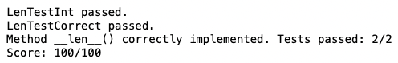
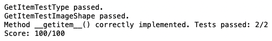
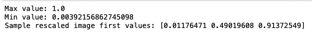
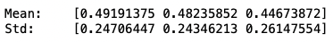
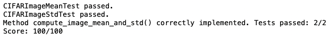
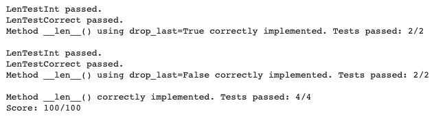
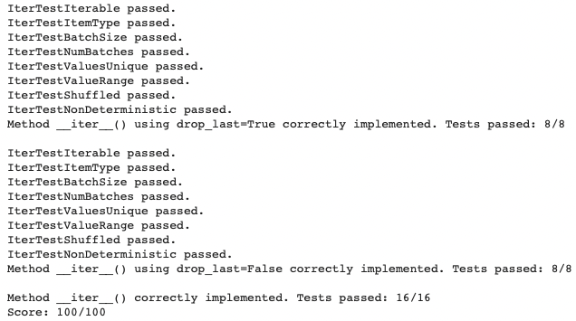

# 深度視覺HW3

B075040041 鄭煥榮

## 1.cifar10-image-dataset

###  len(self)

- 用 len( dataset ) / batchsize 找出length

- 如 drop_last 為 False 且上一行除不盡，length++

  

### getitem(self,index)

- 用 load_image_as_numpy() 讀 images[index] 的圖片並存成 nparray

- return dict

  

  

### call()

- images -= self.mean

- images /= self.std

  

### compute_image_mean_and_std()

- 先把 img reshape 成(-1,3)

- 取 mean

- 取 std

  

  

## 2.dataloader

### len()

- 和第一部分相同

  

## iter()

```python
for idx in index_iterator:

​            batch.append( *self*.dataset[idx] )

​            if( len(batch) == *self*.batch_size ):

​                *# turn to dict*

​                newbatch = *dict*()

​                for i in batch:

​                    for key, value in i.items(): 

​                        if key not in newbatch:

​                            newbatch[key]=[]

​                        newbatch[key].append(value)

​                *# numpy*

​                for key, value in newbatch.items():

​                    newbatch[key] = np.array(value)


​                *# return* 

​                yield newbatch

​                batch = []
```

如果 drop = False 則再執行一次



