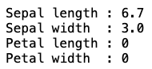
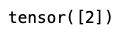
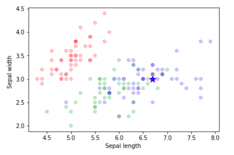

## 

# 深度視覺 HW

### B075040041 資工系 鄭煥榮

---

## compute_distances_two_loops

- 將train跟test透過view 轉成 (shape[0],-1) 的形狀

- 用兩層for迴圈 分別將每個train,test找出尤拉距離

- 結果存入dists[i][j]

## predict_labels

- 用torch.topk找出每一test中離它最近k個train點
  
  - 注意largest=False 才會找值最小的
  
  - dim設為0找每個test對應的train

- 用for迴圈執行每個test

- 將離test最近k個點的label存入list

- 用max(set(mylist),key=,mylist.count) 找出最多的label當作預測值

- 將預測值傳回

## KnnClassifier

#### init

- 用 self.x_train=x_train , self.y_train=y_train 存

#### predict

- 先用 compute_distances_no_loops 算出train,test距離

- 再傳入predict_labels預測結果

## Final Result
- 輸入兩個值（其餘填0）

  
- 印出預測結果

  
- 以輸入值的種類當座標畫出分類圖 並以星星顏色標示出預測結果
  