# 深度學習 HW1
### B075040041 資工系 鄭煥榮 
---
## **Create_sample_tensor, mutate_tensor, count_tensor_elements**
- create 先建立 zero tensors, 再依照題目要求修改
- mutate 利用 for 迴圈 (變數x,y) 讀取 indices 再將tensor修改成value值
- count 則是先用len(x.shape)得知維度，再使用for迴圈將每個維度中的值相乘

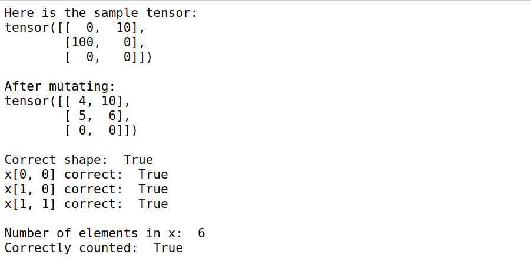

## **Create_tensor_of_pi**
- 用torch.full填入size和值即可

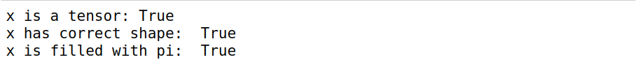

## **Multiples_of_ten**
- 先找出第一個10的倍數 如無則return 
- 再用arange指定每數間隔10和指定tensor dtype

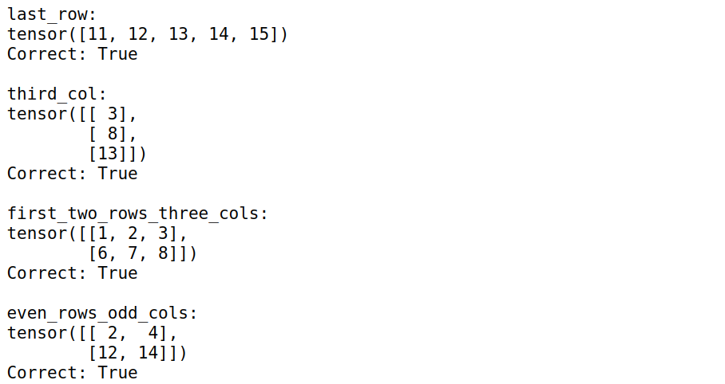

## **Slice_indexing_practice**
- last_row 為最後一行 x[-1,:]
- third_col 為第三列 x[:,2:3]
- first_two_rows_three_cols = x[:2,:3]
- even_rows_odd_cols 偶數從0開始間隔2 奇數從1開始間隔2 x[0::2,1::2]

## **Slice_assignment_practice**
- 先將第一column前兩格填0
- 將第二column前兩格填1
- 將3-6 column前兩格填2
- 將1,3 column後兩格填3
- 將2,4 column後兩格填4
- 將5,6 column後兩格填5

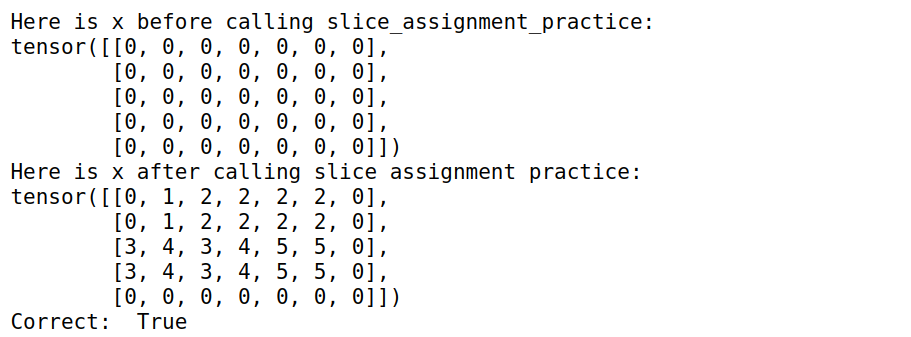

## **Shuffle_cols, reverse_rows, take_one_elem_per_col**
- Shuffle_cols column 用 0,0,2,1 表示
- reverse_rows row 用 shape[0]-1,shape[0]-2,shape[0]-3.........,0表示
- take_one_elem_per_col 用[1,0,3][0,1,2]讀取tensor

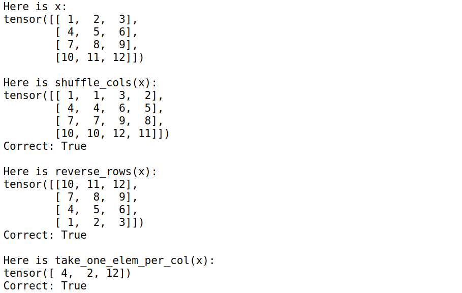

## **Make_one_hot**
- 用zeros建立len(x),max(x)+1的tensors
- 再將代表位置填入1

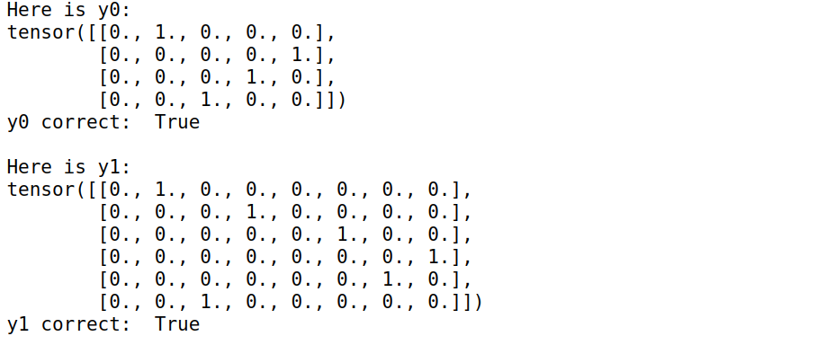

## **Sum_positive_entries**
- 建立positive mask
- mask後sum可得答案

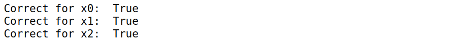

## **Reshape_practice**
- 先轉成2,3,4
- 再permute調換12列 (1,0,2)
- reshape成3,8

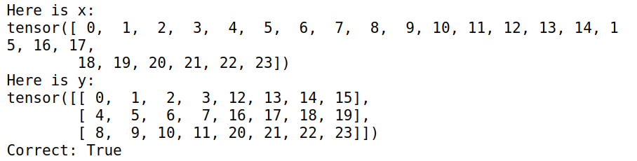

## **Zero_row_min**
- 用torch.min找出dim=1的min和其位置
- 用x[[range(len(row_min_idxs))],row_min_idxs]=0 將最小值替換成0

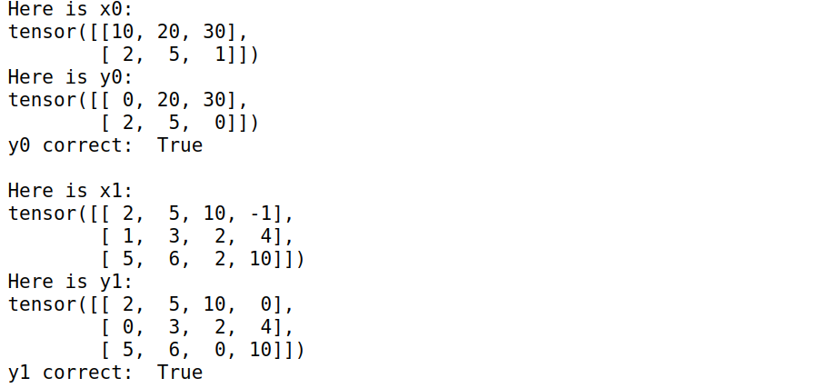

## **Batched_matrix_multiply**
- LOOP版 先做mm將結果存進list
- 再用torch.stack把list內tensor合併
- 無LOOP直接用bmm

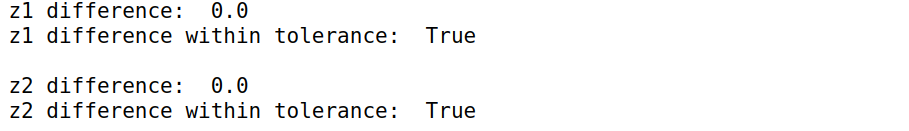

## **Normalize_columns**
- 用torch.sum再除shape算出u
- x-u平方再sum最後除shape-1
- sqrt即可解

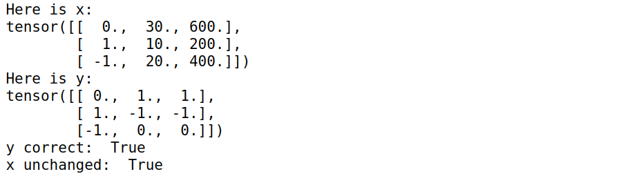

## **Mm_on_gpu**
- 用.cuda()轉換再.mm()
- .cpu()轉回來
- 這邊誤差值與cpu有點大(0.07~0.08)試各種寫法仍然diff很高，更新了pytorch版本還是沒有改善，不知道哪裡出了問題

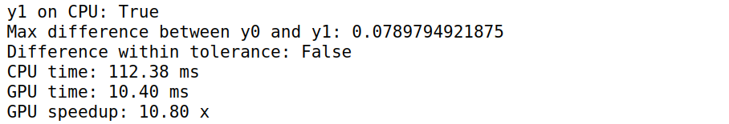
