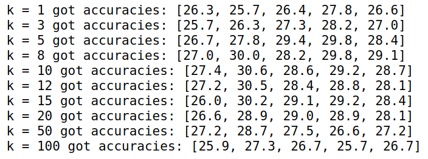

## 

# 深度學習 HW1

### B075040041 資工系 鄭煥榮

---

## compute_distances_two_loops

- 將train跟test透過view 轉成 (shape[0],-1) 的形狀

- 用兩層for迴圈 分別將每個train,test找出尤拉距離

- 結果存入dists[i][j]
  
  
  
  
  
  

## compute_distances_one_loop

- 將train跟test透過view 轉成 (shape[0],-1) 的形狀
- 對train做for loop 每個train減去整個test(broadcast) 之後一樣找出尤拉距離
- 結果存入dists[i]
  
  
  
  

## compute_distances_no_loops

- 將train跟test透過view 轉成 (shape[0],-1) 的形狀

- $ \sqrt{(a-b)^2} = \sqrt{a^2+b^2-2ab} $

- 先用torch.mm將 $A$  跟 $B^T$ 相乘得到ab，再乘上-2

- $a^2$ 跟 $b^2$ 求法為先pow(2)再sum得兩vector，再利用broadcast特性加回 -2ab

- 最後將整個tensor存回dists
  
  
  
  &nbsp;

## predict_labels

- 用torch.topk找出每一test中離它最近k個train點
  
  - 注意largest=False 才會找值最小的
  
  - dim設為0找每個test對應的train

- 用for迴圈執行每個test

- 將離test最近k個點的label存入list

- 用max(set(mylist),key=,mylist.count) 找出最多的label當作預測值

- 將預測值傳回
  
  

## KnnClassifier

#### init

- 用 self.x_train=x_train , self.y_train=y_train 存

#### predict

- 先用 compute_distances_no_loops 算出train,test距離

- 再傳入predict_labels預測結果
  
  
  
  ##### k=5
  
  

## knn_cross_validate

- 先用chunk(num_folds , dim=0) 將x,y平均切成等分

- 用for loop每種k值

- 第2層for選擇要validate的資料 其餘當train

- 將結果存進 k_to_accuracies
  
  

&nbsp;

&nbsp;

&nbsp;

&nbsp;

&nbsp;

## knn_get_best_k

- 先將每個dict內data值替換成list的平均

- 和前面找nearest neighbor一樣，用max找出準確率最高key
  
  

## Final Result

    
