# 深度學習 ＨＷ3

## B075040041 資工系 鄭煥榮

---

## svm_loss_naive

- 第一層 for 將每個train資料遍尋

- 將 Weight 乘上 X[i] 

- 第二層 for 將上一步的結果遍尋

- 略過正確 label

- 將不正確的 label 的值加入 loss

- dW 用小考公式 dW[:,j] += X[i] 為 + Xi 情況

- dW[:,y[i]] -= X[i] 為-X[i]情況

- 最後再 regulize

  

  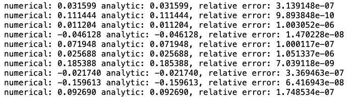
  
  
  
  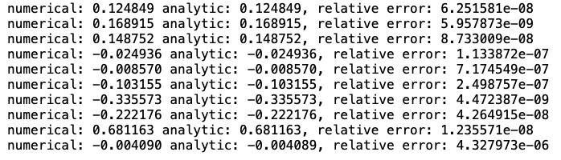

## svm_loss_vectorized

### loss 計算

- 先將 X 乘 Weight 得到 score (torch.mm)
- 找出正確 label 所在位置
- 找出正確 label 的 score
- 將 score - 正確 lablel 的 score 得到 diff
- Diff 內值 +1 bias
- 把正確 label 的 diff 設為 0 
- 再把 diff 值小於 0 的值設為 0
- 最後把 diff 值全部加起來得到 loss
- 標準化 loss

### dW 計算

- 把 diff 值 >1 的設為 1

- 把 diff axis=1 做相加 乘上 -1 得到 neg 相當於前一題的 -X[i]

- 將 diff 中正確 label 值設為 neg

- 把 X 轉置後乘上 diff 相當於做加減

- 把 dW 標準化

  

  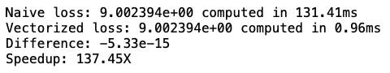

  

  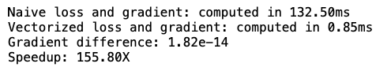

## sample_batch

- 用 torch.randint 生成總共 batch_size 個 0~num_train 的隨機 int
- 將生成的 int 當 index 把 X[index] 加入 X_batch
- 同理把 y[index] 加入 y_batch

## update Weight

- 將 Weight - learning_rate * dW

  

  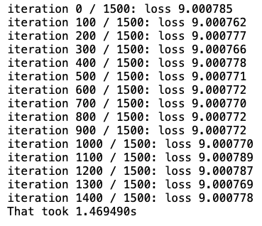

## predict_linear_classifier

- X 乘上 Weight 得到 score

- 用 torch.argmax 找出 score 在 dim=1 時的最大值 index

  

  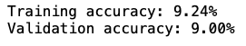

## svm_get_search_params

- 先測試 lr  , rs 為 1e-1 , 1e-2 , 1e-3 , 1e-4 , 1e-5 
- 發現 lr 為 1e-3 時 rs 為 1e-2 時表現最好
- lr 測試 1e-3 , 2e-3 , .... 5e-3
- rs 測試 1e-2 , 2e-2 , .... 5e-2

## test_one_param_set

- 把 dict 中 X_train , y_train 還有 lr , reg , num_iters 丟進 cls.train()

- 訓練完成後分別對 X_train 和 x_val 做預測

- 算出準確率

  

  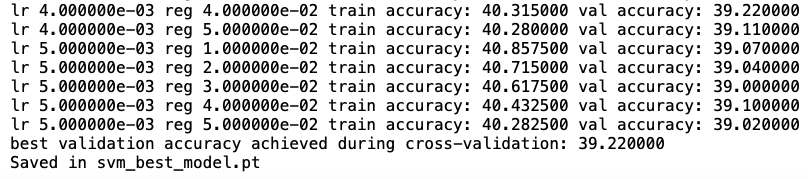 

  

  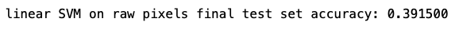

## soft_max_loss_naive

- 第一層迴圈對每張圖做遍尋

- 乘上 Weight 得到 score

- 把 score 減去最大值

- 把 score 做 exp 

- 找出正確 label 的 exp score

- 把 loss - log (正確值/所有值) 類似機率

- 再用 y 遍尋每個 score 中元素

- 由 dW 公式可知

- y 為正確 label 時 dW[:,y[i]] = (expscore[j]/expscore.sum()-1) * X[i,:]

- 否則 dW[:,j] += (expscore[j]/expscore.sum()) * X[i,:]

- 把 loss , dW 正規化

  

  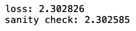

  

  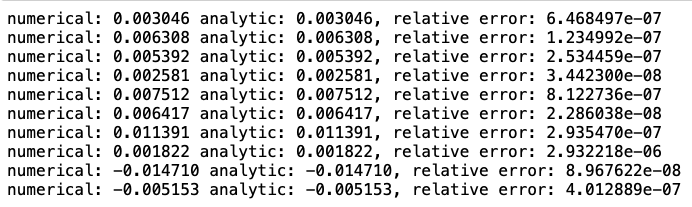

  

  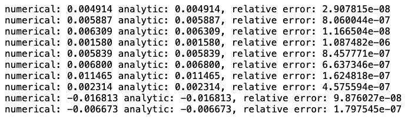

  

## softmax_loss_vectorized

### loss

- 和 svm vectorized 做法大同小異
- 先把 X 乘上 W 得到 score 將其轉置方便後續運算
- 找出最大值並將 score 減去每個最大值
- 將 score exp 後找出正確 label 的 exp score
- loss 為 -log(正確exp score / exp score 相加) 的結果 sum
- loss 正規化

### dW

- 把 exp score / expscore對dim=0的sum 暫存為 temp

- 把 temp 中所有正確 label 值減 1

- dW 為 temp 乘上 X 之後再轉置

- 正規化 dW

  

  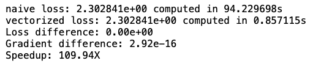

  

  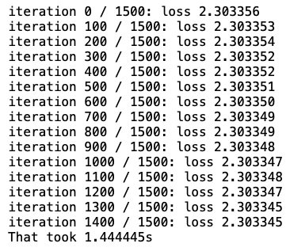

  

  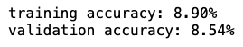

## softmax_get_search_params

- 先測試 lr  , rs 為 1e-1 , 1e-2 , 1e-3 , 1e-4 , 1e-5 

- 發現 lr 為 1e-1 , rs 為 1e-5 時表現最好

- 所以 lr 選擇 1e-1,2e-1,3e-1,4e-1,5e-1

- rs 選擇 1e-5, 2e-5, 3e-5, 4e-5, 5e-5

  

  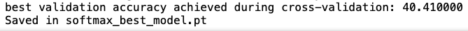

  

  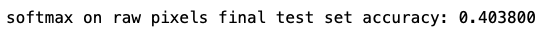

  

  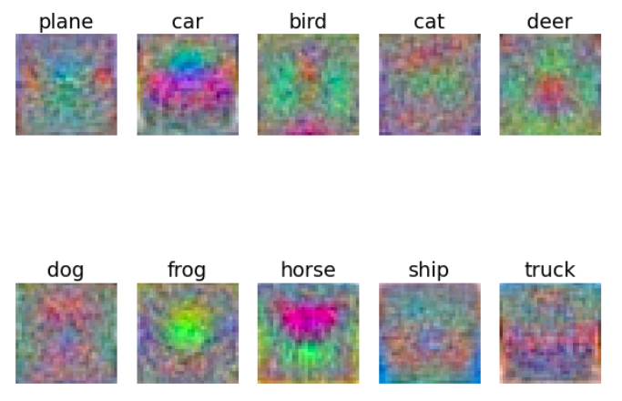