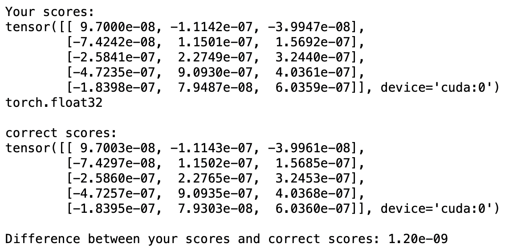
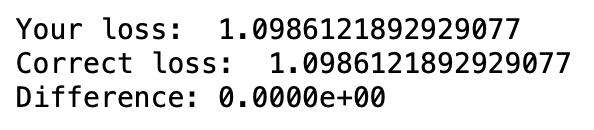
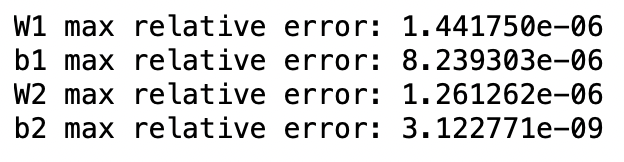
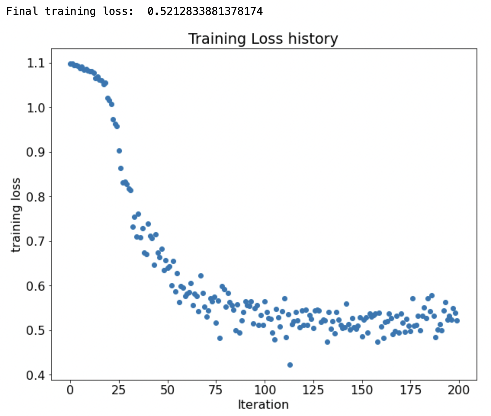
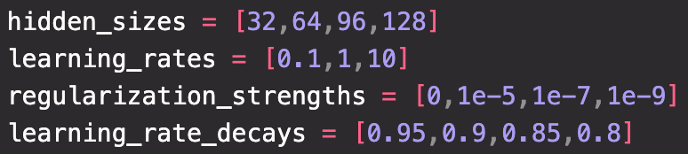
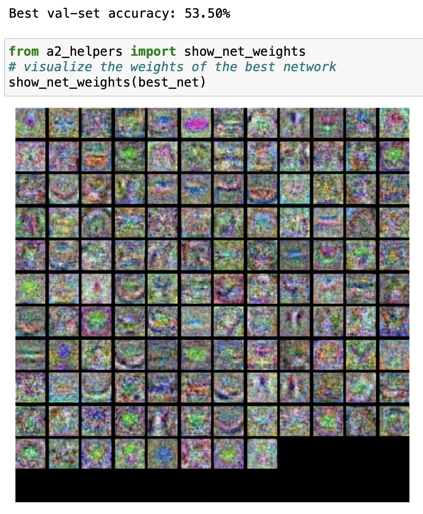
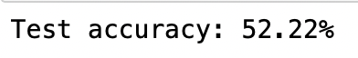

## 深度學習 HW4

b075040041 資工系111 鄭煥榮

### nn_forward_pass

- hidden 為 X 乘上 W1 再加上 b1

- 用 clamp 取 relu

- scores 為 hidden 取完 relu 後乘上 W2 再加上 b2

  

### nn_forward_backward

#### loss

- 和上次作業一樣，先把 scores 轉置
- 找出最大值 (axis = 0)
- scores 減去最大值後取 exp
- 找出正確的 expscore 得 expscore_correct
- loss = torch.sum(-torch.log(expscore_correct / sum(expscore)))
- 把 loss 標準化

#### backward

- 把前面得到的 expscore 轉置

- 轉置後正確的 label 內的值 -1求得 dS

- dH 為 dS 乘上 W2 的轉置 （符合微分後的 size)

- dW2 為 h1 轉置後乘上 dS

- db2 為 dS 在 axis = 0 的 sum

- 先找 mask = (h1 == 0)

- dZ 為 dH[mask] =0

- 把每個微分後結果標準化

  

  

### nn_train

- 把 W1,b1,W2,b2 分別減去自己的微分結果乘上 learning_rate

### nn_pred

- 用 loss() 算出 score

- 用 argmax 找出最大值的 label

  

### nn_get_search_params

- 由題目測試範例可知各項參數的個別表現，所以我們將最好的結果切割得更細並交叉測試找出最好的超參數

  

  

### find_best_net

- 用 4 個 for 迴圈 iter 每個超參數總和

- train 方法和題目範例相同

- 每次 train 完比對 val 的準確度，如果新模型準確度較高，將他存進 best net

  

  

  